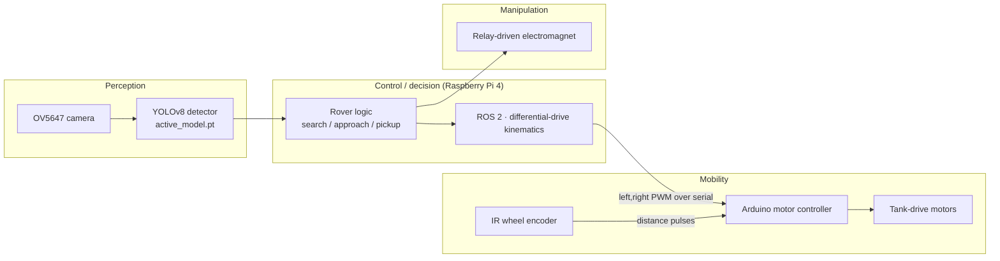

# Autonomous Sorting Rover

**A ground-up autonomous robot that finds real-world objects with a custom-trained
vision model, drives to them with closed-loop wheel odometry, and collects them.
Spans mechanical CAD, embedded firmware, motion control, and a full computer-vision
pipeline.**

This repository is the complete engineering record of that system: the SolidWorks
parts, the Arduino motor and sensor firmware, a ROS 2 control stack, a custom-trained
YOLO object detector, and a browser-based MLOps platform that runs the entire
data-to-deployment loop.

---

## What this project demonstrates

| Domain | In this repo |
| --- | --- |
| **Mechanical design (CAD)** | Custom SolidWorks parts — Pi enclosure with cooling clearance, an angled camera mount, a chassis bridge, and a collection funnel — modeled parametrically and exported to STL/STEP for 3D printing. |
| **Embedded / electrical** | Arduino firmware driving a dual-motor H-bridge over PWM; a non-blocking, timer-based motion controller with empirically calibrated in-place turns; a relay-driven electromagnet end-effector; Raspberry Pi ↔ Arduino serial link. |
| **Sensing & controls** | Closed-loop **wheel odometry** from a TCRT5000 IR encoder with real signal-conditioning (debounce, held-signal validation, pulse-gap rejection); differential-drive kinematics; a native **ROS 2 Humble** control stack. |
| **Computer vision / ML** | A YOLOv8 detector trained on self-recorded data (5 classes, **mAP@0.5 ≈ 0.99**, mAP@[.5:.95] ≈ 0.78 on a held-out split), with a human-in-the-loop labeling and retraining workflow. |
| **Software / MLOps** | An 8-stage **Training Control Center** (browser app, Python-stdlib server) that owns upload → auto-label → review → versioned training → live test → hard-negative retraining → deploy, with a model registry and leakage-safe dataset splitting. |
| **Systems integration** | Four subsystems — perception, mobility, manipulation, and control — designed to compose on real hardware through clean, swappable interfaces. |

---

## System architecture



The seams between subsystems are deliberate: perception publishes detections,
control converts intent to a body-frame velocity, and the drive layer turns that
velocity into motor commands. Each boundary is a single, well-defined interface, so
any one subsystem can be swapped or simulated without touching the others.

---

## Subsystem deep-dives

### 1 · Mechanical design — SolidWorks (`solidworks/`)

Every custom bracket on the rover is designed in SolidWorks rather than improvised,
so the mechanical layout evolves in lockstep with the electronics:

- **`pi_holder.SLDPRT`** — a fixed Raspberry Pi 4 mount with clearance for a cooling
  setup, giving the controller a defined home on the chassis instead of sitting loose.
- **`15degrees.SLDPRT`** — an angled camera mount that fixes the OV5647 at a controlled
  height and downward tilt, so the detector always sees the ground plane from a known
  viewpoint.
- **`bridge.SLDPRT`** — a structural bridge tying mounting points across the chassis.
- **`funnel.STL`** — a collection funnel for guiding picked-up objects.

Parts are authored natively and exported to neutral **STL/STEP** for printing and
sharing, keeping the design reproducible. The current revisions are **being
3D-printed and fitted to the chassis** as the mechanical design is iterated.

**v1 printed parts** — the first revision of the custom mounts, off the printer and
in hand for test-fitting:

<table>
  <tr>
    <td width="50%" align="center">
      <br/>
      <em>Raspberry Pi enclosure tray — tabbed mounts and cable slots.</em>
    </td>
    <td width="50%" align="center">
      <br/>
      <em>Angled camera-mount wedge — fixes the OV5647 at a set downward tilt.</em>
    </td>
  </tr>
  <tr>
    <td width="50%" align="center">
      <br/>
      <em>Chassis bridge — ties mounting points across the frame.</em>
    </td>
    <td width="50%" align="center">
      <br/>
      <em>Curved mount bracket — printed and ready to fit.</em>
    </td>
  </tr>
</table>

### 2 · Electronics & embedded firmware (`src/serial_drive_turns.ino`)

The Arduino runs a **non-blocking** motion controller — no `delay()` anywhere in the
control loop, so serial input is always responsive and a turn can be aborted mid-motion:

- Drives a dual H-bridge (`PWMA/PWMB` + direction pins + standby) with separate cruise
  and turn PWM levels, chosen so the wheels *scrub* cleanly instead of stalling.
- **In-place turns from a single calibration constant:** one measured "milliseconds per
  90°" value scales to any commanded angle (`right,45` / `left,90`), a pragmatic
  open-loop heading primitive that's honest about its one tunable number.
- Timer-based turn completion (`millis()` deadlines) instead of blocking waits.
- A relay-controlled **electromagnet** end-effector for collecting metal objects,
  bench-validated with a relay + LED stand-in ahead of final wiring.

The Raspberry Pi issues high-level commands over serial (`src/main.py`), keeping
low-level timing on the microcontroller and decision-making on the Pi.

### 3 · Wheel odometry — closed-loop distance control (`tests/ir_wheel_tape_pulse_test/`)

To turn "go forward one foot" into a *measured* foot, the rover reads a TCRT5000 IR
reflectance sensor watching white tape marks on a 2.6″ wheel. The firmware is a small
exercise in real sensor engineering:

- **Geometry → distance:** `inches_per_pulse = π · diameter / pulses_per_rev`, so the
  controller drives until it has counted enough pulses for the requested distance —
  a genuine closed loop on distance, not a timed guess.
- **Signal conditioning against false counts:** a pulse only registers after the sensor
  reads white *continuously* for a minimum duration (rejecting glints, seams, and
  reflections), with an additional minimum pulse-gap guard — debouncing done properly.
- **Live telemetry:** streams pulse count, revolutions, distance, RPM, and in/s so the
  behavior is observable and tunable during bring-up.
- Optional active-braking pulse to cancel coast at the target.

> 🎥 **Wheel-odometry bring-up demo:** [`docs/images/2026-07-20/IMG_2432.MOV`](docs/images/2026-07-20/IMG_2432.MOV)

### 4 · Motion control & ROS 2 (`ros2_ws/`)

A native **ROS 2 Humble** workspace (installed via RoboStack on Apple Silicon — no
Docker, VM, or simulator) implements teleoperated differential drive with textbook-clean
separation of concerns:

- **`differential_drive.py`** — pure `Twist (v, ω) → (left, right)` kinematics with
  **zero ROS or hardware dependencies**, normalized and clamped to the motor range. Being
  dependency-free is what makes it reusable and unit-testable.
- **`keyboard_node`** publishes `geometry_msgs/Twist` on `/cmd_vel`; **`fake_motor_node`**
  subscribes and prints motor values. `/cmd_vel` is the *single* integration point, so a
  real `arduino_bridge_node` drops in — reusing the same kinematics — without changing the
  teleop or the message contract.
- Chassis geometry (wheel base, max speeds, output scale) is exposed as **ROS parameters**,
  so a different robot needs no code change. Nodes are cross-platform (`termios`/`msvcrt`).

### 5 · Perception — custom YOLO detector

The detector is trained entirely on the rover's own recordings, not a stock dataset:

- **YOLOv8**, fine-tuned to four classes (**bit, wrench, jenga, screwdriver**) from ~712
  self-recorded, human-reviewed images across multiple versioned models.
- Latest model: **mAP@0.5 ≈ 0.99**, **mAP@[.5:.95] ≈ 0.78** on a held-out validation split.
- Runs live on a webcam or the Pi camera, drawing labeled boxes with confidence, with
  temporal box-smoothing to steady detections (`src/desktop_yolo_detector.py`).
- **Negative/background images** are first-class training data to suppress false positives
  on empty scenes — the model is explicitly taught what "nothing" looks like.

### 6 · The Training Control Center — an end-to-end ML platform (`gui/`, `ml/`)

The most substantial piece of software here is a self-built **MLOps platform** that runs
the whole model lifecycle from a browser, backed only by the Python standard library (no
web framework) with a modular route/API design and state derived live from the filesystem:

1. **Upload Clips** — organize source videos per object class.
2. **Process Dataset** — extract frames and auto-draw boxes (classical CV: top-hat/black-hat
   morphology to segment the object), building a YOLO dataset.
3. **Review / Edit Labels** — pass, fail, or drag-redraw every box with keyboard shortcuts;
   rejected frames are quarantined but recoverable.
4. **Train Model** — versioned training with presets; every run saves
   `models/yolo_detector_vN.pt` and logs precision/recall/mAP to a registry.
5. **Test Detector** — run any version live and capture mistakes in one click.
6. **Retraining Queue** — correct captured failures (or mark them background) and fold them
   back in — a proper **hard-negative mining loop**.
7. **Deploy** — promote a chosen model into the Pi deploy bundle behind a checklist.
8. **Danger Zone** — guarded destructive/maintenance actions.

Engineering details that matter: the **train/val split is by whole source video**, never by
frame, so near-identical frames can't leak across the split and inflate metrics; models are
**versioned and never overwritten**; and a Raspberry Pi recorder (`src/record_video.py`)
captures training footage from the deployment camera itself to close the train-vs-deploy
domain gap.

#### The workflow, screen by screen

A live sidebar (dataset stats + pipeline checklist) is always visible; each tab is one stage
of the loop. *(Screenshots are from an earlier 4-class run; the current model adds a 5th class.)*

<table>
  <tr>
    <td width="50%" align="center">
      <br/>
      <b>1 · Upload Clips</b> — organize the videos you recorded, per object class.
    </td>
    <td width="50%" align="center">
      <br/>
      <b>2 · Process Dataset</b> — extract frames, auto-draw boxes, fold in background negatives.
    </td>
  </tr>
  <tr>
    <td width="50%" align="center">
      <br/>
      <b>3 · Review / Edit</b> — pass, fail, or drag-redraw every box with keyboard shortcuts.
    </td>
    <td width="50%" align="center">
      <br/>
      <b>4 · Train Model</b> — versioned training, by-video split, live metrics &amp; curves.
    </td>
  </tr>
  <tr>
    <td width="50%" align="center">
      <br/>
      <b>5 · Test Detector</b> — run a version live on a camera; capture mistakes in one click.
    </td>
    <td width="50%" align="center">
      <br/>
      <b>6 · Retraining Queue</b> — correct captured failures (or mark background), fold back in.
    </td>
  </tr>
  <tr>
    <td width="50%" align="center">
      <br/>
      <b>7 · Deploy</b> — promote the active model into the Pi deploy bundle behind a checklist.
    </td>
    <td width="50%" align="center">
      <br/>
      <b>8 · Danger Zone</b> — guarded data-wipe / start-over maintenance.
    </td>
  </tr>
</table>

---

## Current status

- **Physical rover built** — tank-drive chassis, Raspberry Pi 4, OV5647 camera, Arduino
  motor control over serial, relay + electromagnet bench-proven. The custom SolidWorks
  mounts are currently being **3D-printed and fitted** as the design is iterated.
- **Vision working** across 4 classes from self-recorded, human-reviewed data; multiple
  versioned models tracked with metrics.
- **Training Control Center** driving the full upload → … → deploy loop.
- **ROS 2 teleop → kinematics → motor node** running (simulated motor output today; the
  serial bridge is designed as a drop-in).
- **Wheel odometry** firmware written and in bring-up — closing the loop on measured
  distance travel.
- **Next:** wire the ROS 2 serial bridge to hardware and compose a first end-to-end
  search → approach → pickup run.

<p align="center">
  
  
  <br/>
  <em>Early proof-of-concept build — kept for reference. The current design has advanced
  significantly beyond what's shown here.</em>
</p>

---

## Repository layout

```text
solidworks/        # SolidWorks parts + STL/STEP exports (mechanical design)
src/
  serial_drive_turns.ino   # Arduino: non-blocking motor control + calibrated turns
  main.py                  # Raspberry Pi: drive the rover over Arduino serial
  desktop_yolo_detector.py # live YOLO detector (webcam / Pi camera)
  record_video.py          # capture training footage on the Pi camera
tests/
  ir_wheel_tape_pulse_test/ # Arduino: IR wheel-encoder closed-loop distance control
  rectangle_detect.py       # early color-segmentation CV proof of concept
ros2_ws/           # ROS 2 Humble control workspace
  src/rover_control/        # differential_drive.py, keyboard_node, fake_motor_node
gui/               # Training Control Center — browser app (stdlib server)
  app.py  server.py  jobs.py  state.py  api/  web/
ml/                # dataset + model logic (importable + CLI)
  extract_frames.py  auto_label_frames.py  process_dataset.py  train_yolo.py  ...
models/            # versioned detectors + active_model.pt + registry.json
data/              # raw_videos, frames, yolo_dataset, review/retrain state
```

---

## Running it

**Training Control Center** (the recommended way to drive the whole ML pipeline):

```bash
pip install -r requirements.txt
python gui/app.py            # opens the browser control center
```

**Live detector** on your computer's webcam:

```bash
python src/desktop_yolo_detector.py
```

**ROS 2 teleop** (two terminals, after building the workspace — see `ros2_ws/README.md`):

```bash
ros2 run rover_control fake_motor_node   # terminal A
ros2 run rover_control keyboard_node     # terminal B
```

**Raspberry Pi** runs a lean runtime checkout (operational rover code + hardware tests only);
`src/main.py` sends drive commands to the Arduino over serial.

---

## Roadmap

1. Wire the ROS 2 `/cmd_vel` serial bridge to the Arduino for closed-loop driving.
2. Finish IR wheel-odometry integration so distance commands travel true.
3. Run the detector on-device (Pi, or an Edge-TPU export) for real-time inference.
4. Define the rover state machine: search → approach → pickup → release.
5. First integrated autonomous sorting run.
```
